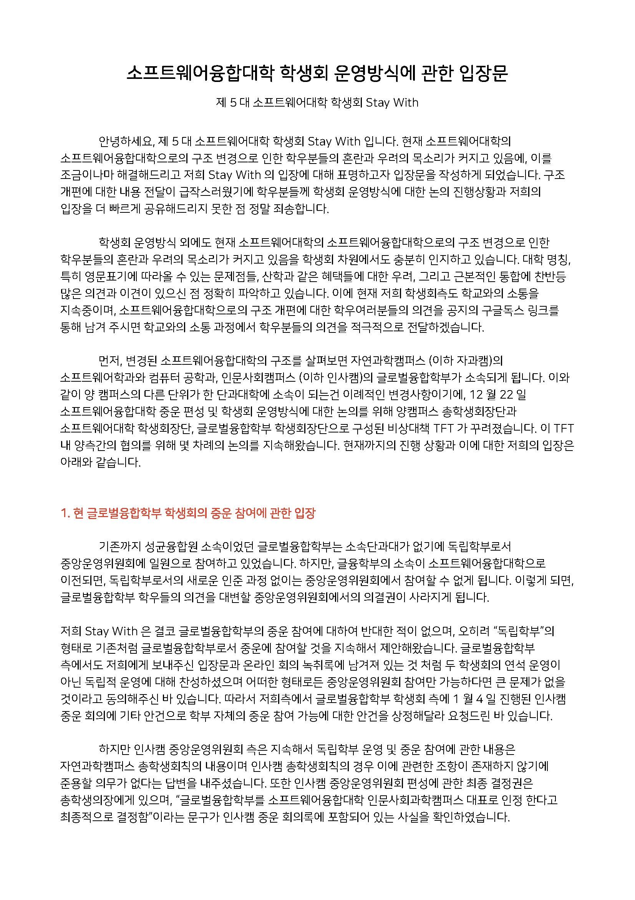
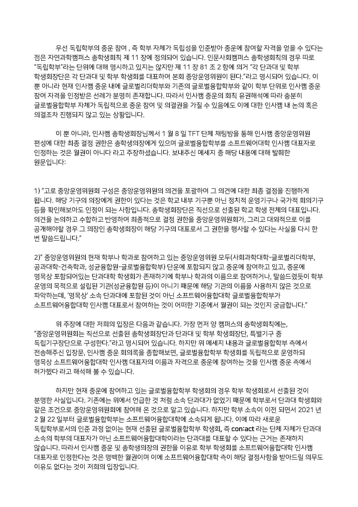
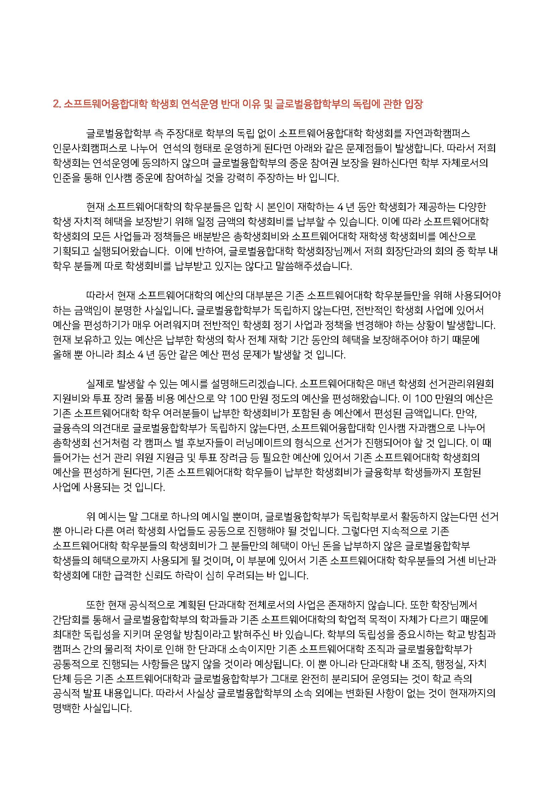
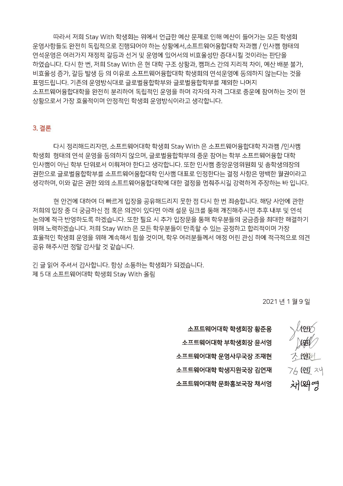

이미지 및 게시글 출처: 소프트웨어대학 학생회 Stay With    
[소프트웨어대학 구조개편 관련 의견 수립 및 학생회 운영방식에 대한 입장문]

안녕하세요, 제 5대 소프트웨어대학 학생회 Stay With 입니다.     
현재 소프트웨어대학의 소프트웨어융합대학으로의 구조 변경으로 인한 학우분들의 혼란과 우려의 목소리가 커지고 있음을 학생회 차원에서도 충분히 인지하고 있습니다.    

이에 현재 저희 학생회측도 학교와의 소통을 지속중이며, 소프트웨어융합대학으로의 구조 개편에 대한 학우여러분들의 의견을 아래 구글독스 링크를 통해 남겨 주시면 학교와의 소통 과정에서 학우분들의 의견을 적극적으로 전달하겠습니다.    

📎 의견개진 구글폼 링크 : https://bit.ly/35nnjMQ

다만 현재 커뮤니티 게시판에 언급되고 있는 소프트웨어융합대학학생회 운영방식에 대해서는 저희 소프트웨어대학 학생회 Stay With이 직접 입장을 표명하는것이 학우분들의 혼란을 조금이나마 해소시켜 드릴 수 있을 것 같아 아래의 입장문을 작성하게 되었습니다.     
입장문 전문은 아래의 드라이브 링크에서 확인하실 수 있습니다.    

📎 입장문 링크 : https://bit.ly/38tHgU2

긴 글이지만 저희 단과대학의 발전을 위해 읽어봐주시고 이에 대한 학우분들의 의견을 자유롭게 개진해주시면 감사하겠습니다.    

